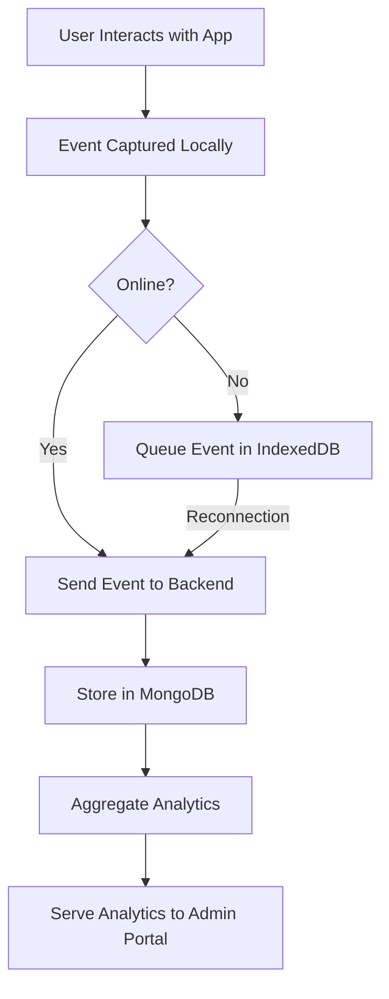
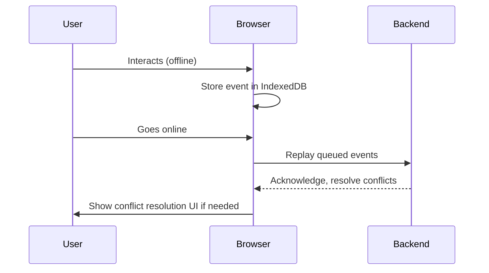

# Solution Blueprint: Offline-First User Journey & Analytics Portal

## 1. Why & How: Technology Choices and Implementation Strategy

### Why These Components?
- **Node.js + TypeScript (Backend):** Type safety, scalability, and async event handling for high-throughput event ingestion.
- **Next.js + TypeScript (Frontend):** Server-side rendering, fast navigation, and robust offline support with PWA features.
- **MongoDB:** Flexible schema for event data, powerful aggregation for analytics, and native support for offline-first patterns.

### Implementation Strategy
- **Backend:**
  - RESTful API for event ingestion and analytics queries.
  - Store raw events and aggregate analytics in MongoDB.
  - Use indexes for fast filtering and aggregation.
- **Frontend:**
  - Multi-page Next.js app (5 pages) tracking user activity.
  - Service Worker + IndexedDB for offline event capture and replay.
  - Admin portal for analytics, search, and visualization.
  - Conflict resolution UI for sync issues.

## 2. Key Flows & Diagrams

### Data Flow Overview

### Offline Sync & Conflict Resolution

## 3. Anticipated Challenges & Solutions
- **Offline Sync:** Ensuring no data loss and correct ordering. Solution: Use IndexedDB for persistent queue, replay with timestamps.
- **Conflict Resolution:** Handling duplicate or conflicting events. Solution: UI for user/admin to resolve, backend deduplication logic.
- **Analytics Performance:** Fast aggregation over large datasets. Solution: MongoDB indexes, pre-aggregation for common queries.
- **State Persistence:** Surviving reloads/restarts. Solution: IndexedDB/localStorage for offline state.
- **Scalability:** Handling spikes in events. Solution: Async processing, horizontal scaling, MongoDB sharding if needed.

## 4. Reflections: Trade-offs & Insights
- **Trade-offs:**
  - Chose REST over WebSocket for simplicity, but could switch for real-time needs.
  - IndexedDB is more complex than localStorage but necessary for structured, persistent offline data.
  - Pre-aggregation improves analytics speed but adds complexity.
- **Lessons:**
  - Offline-first requires careful sync and error handling.
  - User experience is key: clear feedback on sync status and conflicts.
- **Unique Insights:**
  - Combining PWA features with robust backend analytics creates a seamless user/admin experience.

## 5. Impact & Metrics
- **Performance:** End-to-end event sync under 1s when online; offline queue flush within 2s of reconnection.
- **Scalability:** Support 1000+ concurrent users, 10k+ events/hour.
- **User Experience:** No data loss, clear conflict resolution, fast analytics (<500ms query time).

## 6. MongoDB Seeding Instructions
- Use the provided `seed.js` script to populate sample users, sessions, and events.
- Run: `node seed.js` after starting MongoDB.

---

# End of Blueprint 